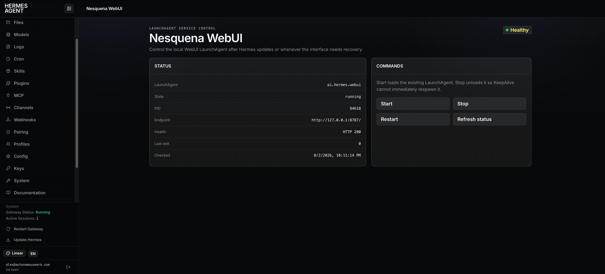

# Hermes Workbench

Opinionated plugins and themes for shaping Hermes Agent into an integrated command center across the autonomous work stack.

Each addition is intentionally designed to be lightweight and non-duplicative with core functionality.

## Plugins

### [Buzz Control](./plugins/buzz-control)

Monitor a local Buzz relay, see its configured location and latest image, and safely apply updates from the Hermes dashboard on demand or every 12 hours.

### [Nesquena WebUI Control](./plugins/nesquena-webui-control)

Start, stop, restart, and inspect a launchd-managed Nesquena WebUI from the Hermes Agent web dashboard.

## Themes

### [Linear](./themes/linear)

An unofficial, Linear-inspired dark theme for the built-in Hermes Agent web dashboard.

## Principles

- **Opinionated by design** — strong defaults instead of endless configuration
- **Built for autonomous work** — focused on visibility, control, and operational confidence
- **Modular** — install only the plugins and themes that fit your workflow
- **Cohesive** — individual extensions should feel like parts of the same workbench
