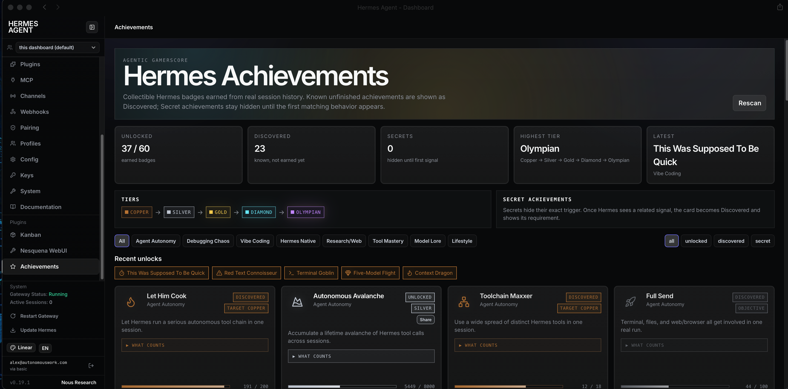

# Hermes Workbench

Opinionated plugins and themes for shaping Hermes Agent into an integrated command center across the autonomous work stack.

Each addition is intentionally designed to be lightweight and non-duplicative with core functionality.

## Themes

### [Linear](./themes/linear)

An unofficial, Linear-inspired dark theme for the built-in Hermes Agent web dashboard.

## Plugins

- **[Nesquena WebUI Control](./plugins/nesquena-webui-control)** — Start, stop, restart, and inspect the Nesquena WebUI from the Hermes dashboard.
- **Blocks Buzz** *(coming soon)* — Server health monitoring and management.
- **Backboard** *(coming soon)* — Status and visibility for backup scripts covering Hermes and supported components, including macOS LaunchAgents and Cloudflare R2.

## Principles

- **Opinionated by design** — strong defaults instead of endless configuration
- **Built for autonomous work** — focused on visibility, control, and operational confidence
- **Modular** — install only the plugins and themes that fit your workflow
- **Cohesive** — individual extensions should feel like parts of the same workbench
