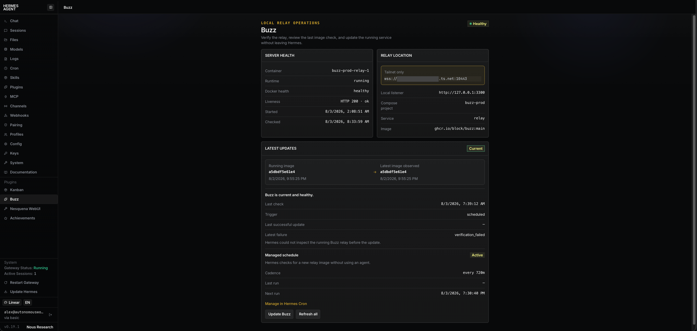

# Buzz Control for Hermes

Buzz Control manages a local [Buzz](https://github.com/block/buzz) relay from
the Hermes dashboard.

The **Buzz** tab shows server health, relay location, the running image, the
latest image observed by the updater, and the managed Hermes schedule. The
**Update Buzz** button runs the same image reconciler used by the schedule.



## Operating model

Hermes owns automatic Buzz image checks. A `no_agent` cron job named
`buzz-control-image-update` runs every **12 hours** by default. It pulls the
public `ghcr.io/block/buzz:main` tag through an authentication-free Docker
configuration, compares image IDs, and recreates only `relay` when the image
changed. An unchanged check does not touch running containers and stays silent.

The schedule is managed in Hermes Cron. Reinstalling this plugin refreshes its
wrapper but preserves an operator-edited cadence, paused state, and delivery
setting.

## Protected configuration

The protected environment remains outside Git at:

```text
~/.config/buzz/prod.env
```

The updater refuses to run unless this is a regular, non-symlink file owned by
the current user with exact mode `0600`. It never prints or rewrites the file.
The Compose recipe is vendored under `deploy/`. Trusted server-side environment
variables can select the project, service, image, deployment files, and relay
location; the browser cannot change those values.

## Install

From this repository, run:

```sh
./plugins/buzz-control/scripts/install.sh
```

The installer symlinks this checkout's `plugins/buzz-control` directory into
`~/.hermes/plugins/`. Run it from a persistent checkout of `main`; the symlink
does not follow Git branch names. If the linked checkout is switched to a
branch that omits Buzz Control, Hermes can no longer discover the plugin.

The installer enables the plugin, copies a regular wrapper into
`~/.hermes/scripts/`, and creates the 12-hour job only if it does not already
exist. Restart the Hermes dashboard after the first install so its Python API
routes are mounted.

## Update behavior

Both manual and scheduled runs use `scripts/update.sh`:

1. Validate the protected environment and fixed deployment inputs.
2. Acquire the shared cross-process lock in Hermes state.
3. Pull only `ghcr.io/block/buzz:main` without personal Docker credentials.
4. Compare the pulled image ID with the running relay image ID.
5. If changed, run `compose up -d --wait --no-deps --pull never relay` for the
   fixed `buzz-prod` project and verify the result.
6. Atomically save a non-secret receipt for the dashboard.

A scheduled run never starts a stopped relay. Pause the job in Hermes during
intentional maintenance; the explicit **Update and start Buzz** action may
restore a stopped relay. No automatic rollback is attempted.

## Trusted configuration

Defaults match a local installation:

| Variable | Default | Purpose |
| --- | --- | --- |
| `BUZZ_CONTROL_DOCKER_BIN` | `/usr/local/bin/docker` | Docker CLI path. |
| `BUZZ_CONTROL_COMPOSE_BIN` | `/usr/local/bin/docker-compose` | Compose CLI path; explicit so isolated Docker settings do not hide the CLI plugin. |
| `BUZZ_CONTROL_DOCKER_HOST` | `unix:///var/run/docker.sock` | Local Docker endpoint; only Unix sockets are accepted. |
| `BUZZ_CONTROL_ENV_FILE` | `~/.config/buzz/prod.env` | Protected production environment. |
| `BUZZ_CONTROL_DEPLOY_DIR` | plugin `deploy/` directory | Vendored Compose capsule. |
| `BUZZ_CONTROL_COMPOSE_PROJECT` | `buzz-prod` | Fixed Compose project. |
| `BUZZ_CONTROL_COMPOSE_SERVICE` | `relay` | Only service reconciled. |
| `BUZZ_CONTROL_IMAGE` | `ghcr.io/block/buzz:main` | Mutable image channel. |
| `BUZZ_CONTROL_SCHEDULE` | `every 12h` | First-install cadence only. |
| `BUZZ_CONTROL_LOCAL_URL` | `http://127.0.0.1:3300` | Local location shown in Hermes. |
| `BUZZ_CONTROL_RELAY_URL` | `ws://127.0.0.1:3300` | WebSocket relay location shown in Hermes. |
| `BUZZ_CONTROL_NETWORK_SCOPE` | `Local only` | Access scope shown beside the relay location. |

The browser cannot supply commands, paths, services, images, or Docker hosts.

## Verification

```sh
PYTHONDONTWRITEBYTECODE=1 python3 -m unittest discover -s plugins/buzz-control/tests -v
node --check plugins/buzz-control/dashboard/dist/index.js
sh -n plugins/buzz-control/scripts/update.sh plugins/buzz-control/scripts/hermes-cron.sh plugins/buzz-control/scripts/install.sh
```

The plugin is available under the [MIT License](./LICENSE).
